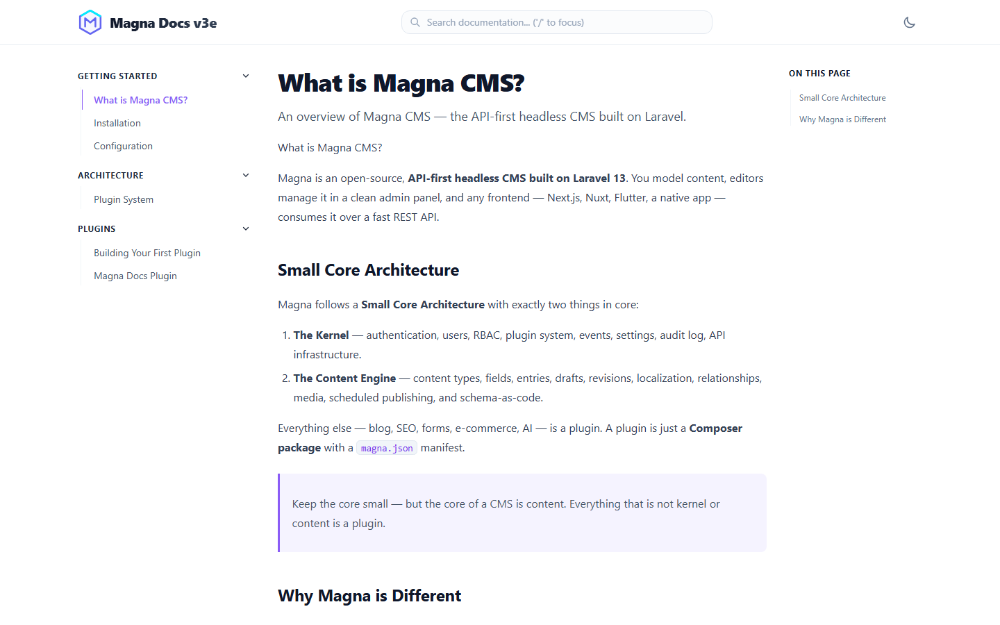
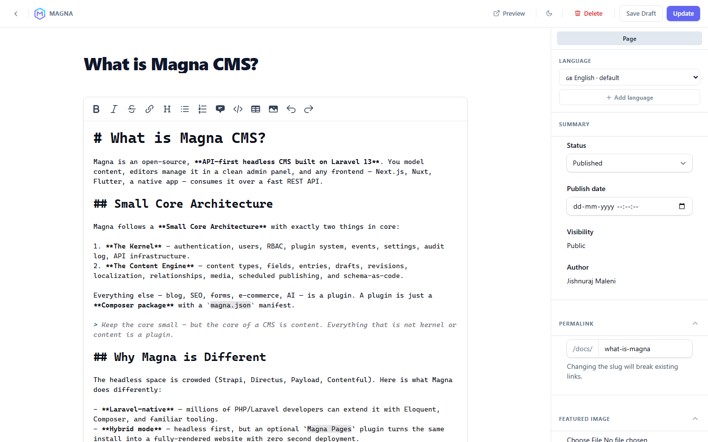
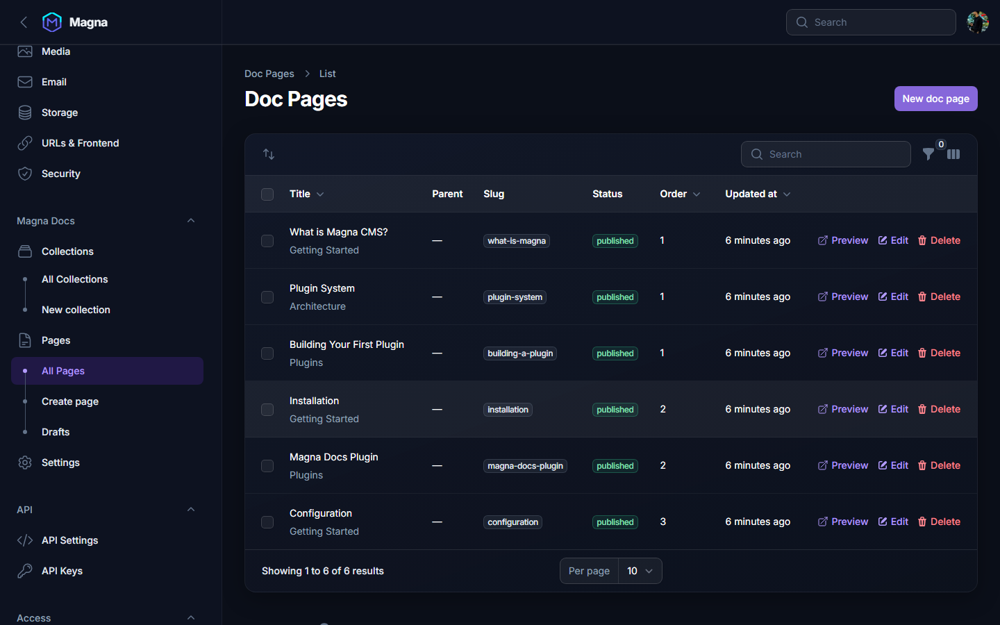
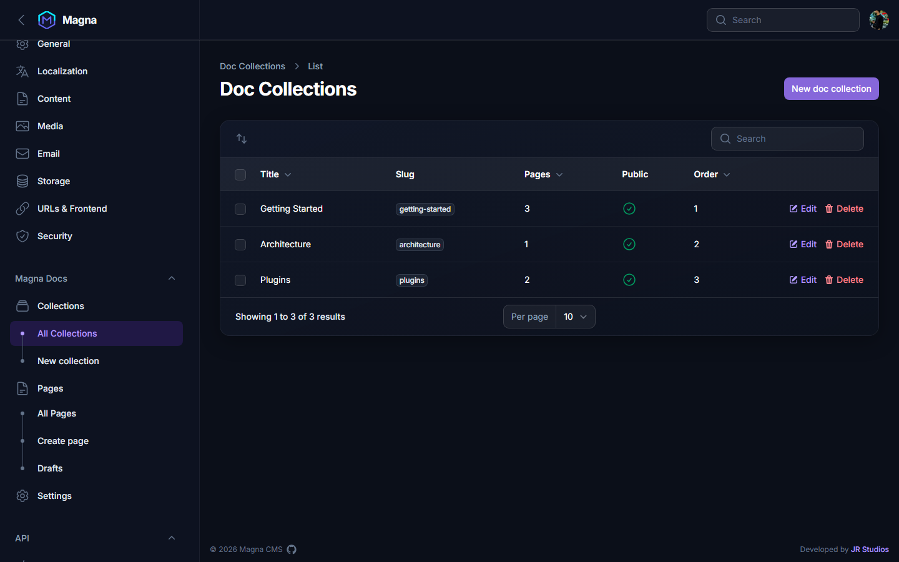
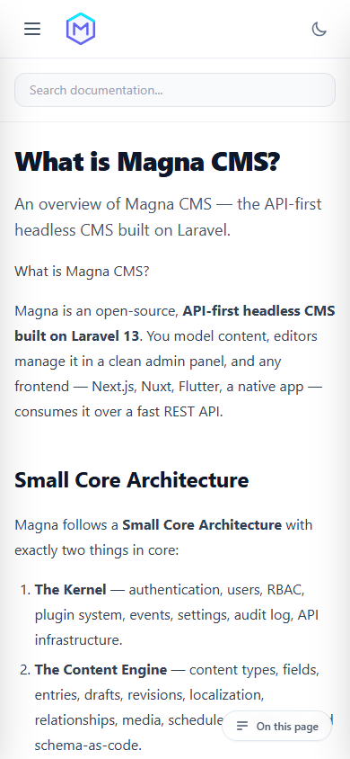
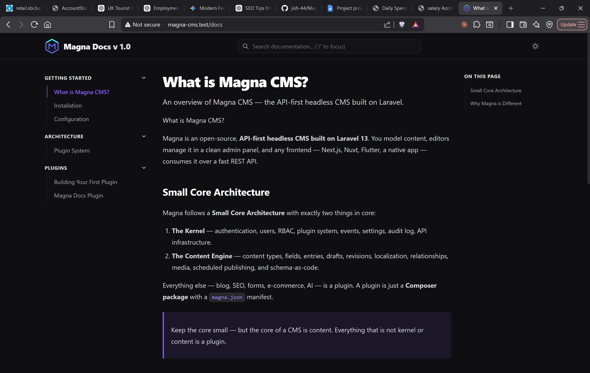
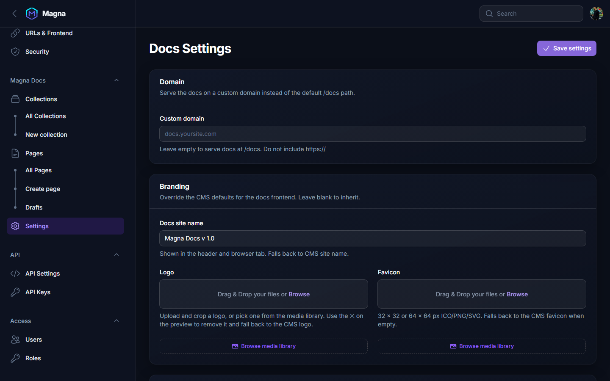

<p align="center">
  
</p>

<h1 align="center">Magna Docs</h1>

<p align="center">
  <strong>A beautiful, full-featured documentation plugin for <a href="https://github.com/jish-44/magna-cms">Magna CMS</a>.</strong><br>
  Write, organize, and publish developer documentation right inside your Laravel admin panel.<br>
  No separate toolchain. No rebuild step. No Node.js required.
</p>

<p align="center">
  
  
  
  
  
</p>

---

<!-- Screenshots — horizontal gallery (scroll to see all) -->
<table>
  <tr>
    <td></td>
    <td></td>
    <td></td>
  </tr>
  <tr>
    <td align="center"><sub>Frontend — light mode</sub></td>
    <td align="center"><sub>Frontend — dark mode</sub></td>
    <td align="center"><sub>Full-screen Markdown editor</sub></td>
  </tr>
  <tr>
    <td></td>
    <td></td>
    <td></td>
  </tr>
  <tr>
    <td align="center"><sub>Admin — Doc Pages list</sub></td>
    <td align="center"><sub>Admin — Collections</sub></td>
    <td align="center"><sub>Mobile view</sub></td>
  </tr>
</table>

---

## Why Magna Docs instead of VitePress / Docusaurus / GitBook?

| Feature | Magna Docs | VitePress / Docusaurus | GitBook / Notion |
|---|---|---|---|
| Runs inside your existing Laravel app | ✅ | ❌ Separate process/deploy | ❌ External SaaS |
| Edits are live instantly (no rebuild) | ✅ | ❌ Must re-run `vite build` | ✅ |
| Fully server-rendered HTML (no React/Vue in browser) | ✅ | ❌ JS framework required | ❌ |
| SEO-ready out of the box | ✅ | ✅ | ⚠️ Limited on free tier |
| Sitemap.xml auto-generated | ✅ | ✅ (with plugin) | ❌ |
| Role-based editor permissions | ✅ | ❌ | ✅ (paid) |
| Nestable pages + collections | ✅ | ✅ | ✅ |
| Dark mode | ✅ | ✅ | ✅ |
| Full-screen distraction-free editor | ✅ | ❌ | ✅ |
| Self-hosted, open-source | ✅ | ✅ | ❌ |
| Media library integration | ✅ | ❌ | ❌ |
| REST API for headless consumption | ✅ | ❌ | ✅ (paid) |
| Zero build step / no Node.js | ✅ | ❌ Requires Node | ❌ |

The core difference: static-site generators compile at build time, so every content edit requires a rebuild and redeploy. Magna Docs renders directly from the database on each request — so saving a draft in the admin is live on the next page load.

---

## Features

### Full-screen Markdown Editor

<p align="center">
  
</p>

- Distraction-free overlay editor covers the entire screen — no Filament chrome visible while writing.
- **Markdown** with rich toolbar: bold, italic, strikethrough, links, headings, bullet/ordered lists, blockquotes, code blocks, tables, and file attachments.
- **Dark / light mode toggle** — persists across saves and page reloads.
- **Auto-save-aware workflow**: Save Draft silently saves without redirecting; Update sets the status to published and shows a confirmation toast.
- **Auto-slug generation**: slug is derived from the title while typing; you can override it manually.

### Draft / Publish Workflow

- Every page starts as a **draft** and is invisible to visitors until published.
- Status is shown as a styled badge in the sidebar (Draft / Published / Archived).
- **Publish date** field appears automatically once a page is published.
- The topbar button changes to **Update** once a page is already published.

### Collections & Nested Pages

<p align="center">
  
</p>

- **Collections** group related pages (e.g. "Getting Started", "API Reference"). Each collection has a title, slug, description, icon, color, and sort order.
- **Nested pages**: any page can be a child of another page (`parent_id`), creating a hierarchy of unlimited depth.
- The sidebar on the public frontend is auto-built from this tree — no manual menu configuration needed.

### Auto Table of Contents

- Every `h2` and `h3` heading in the rendered content is extracted and rendered as a clickable anchor list in the right-hand column.
- Headings get permanent `#` permalink anchors (via CommonMark's heading-permalink extension), so links to specific sections survive refactoring.

### SEO — Zero Config

No plugin, no extra config file. Every page ships:

- Unique `<title>` (meta title field, falls back to page title)
- `<meta name="description">` (meta description field, falls back to truncated excerpt)
- Canonical URL
- Open Graph tags (`og:title`, `og:description`, `og:image`, `og:type`, `og:site_name`)
- Twitter card tags
- JSON-LD structured data: `TechArticle` and `BreadcrumbList`
- Auto-generated `sitemap.xml` at `/docs/sitemap.xml` with `<lastmod>` per page

### Server-Rendered, No Build Step

The frontend is pure Blade + inline CSS. There is no JavaScript framework shipped to the browser — only a small amount of vanilla JS for the Table of Contents scroll-spy and feedback widget. This means:

- **No `npm run build`** required after content changes.
- **Instant previews** — published pages are live on the next browser refresh.
- **Fast by default** — fully-formed HTML is sent on the first request; no hydration delay.
- Rendered HTML is cached per page (keyed on `page_id:updated_at`) and automatically invalidated the moment a page is saved.

### Frontend — Light & Dark Mode

<p align="center">
  
  
</p>

### Featured Image

- Upload an image directly from the editor sidebar (16:9 crop, auto-resized).
- **Or** pick from the Magna media library — browse all uploaded images in a modal, select with one click.
- Toggle whether the featured image appears on the frontend per-page.

### Breadcrumb & Prev / Next Navigation

- Full breadcrumb trail rendered at the top of each page, based on `parent_id` hierarchy.
- Prev / Next navigation cards at the bottom of each page — automatically picks the adjacent page in sidebar order.

### Reading Time & Last Updated

- Reading time is calculated from word count (~200 wpm) and shown in the page footer.
- "Last updated" date rendered from `updated_at` — always accurate, no manual maintenance.

### Page Feedback Widget

- Every published page has a "Was this page helpful?" widget at the bottom.
- Sends a `POST` to a lightweight endpoint; no external service required.

### Docs Settings

<p align="center">
  
</p>

Configure everything from the admin panel under **Magna Docs → Settings**:

| Setting | Description |
|---|---|
| **Custom domain** | Serve docs at `docs.yoursite.com` instead of `/docs` |
| **Site name** | Override the header/tab title for the docs section |
| **Logo** | Upload or pick from media library; falls back to CMS logo |
| **Favicon** | Upload or pick from media library; falls back to CMS favicon |
| **Editor roles** | Restrict who can create/edit pages to specific admin roles |

### REST API for Headless Consumption

If you want to consume the content from a separate frontend (Next.js, mobile app, etc.), every page and the full tree are available as JSON:

| Endpoint | Description |
|---|---|
| `GET /api/v1/docs/tree` | Nested sidebar tree (collections → pages) |
| `GET /api/v1/docs/pages` | Flat list of all published pages (for search indexing) |
| `GET /api/v1/docs/pages/{slug}` | Full content + breadcrumb for a single page |

### Mobile

<p align="center">
  
</p>

Fully responsive — the sidebar collapses on mobile and the layout adapts to any screen width.

---

## Installation

> **Coming soon — one-click install:** Magna CMS will gain a built-in plugin marketplace where you can install Magna Docs (and any other plugin) directly from the admin panel with a single click — no terminal, no `composer.json` edits, no file copying. This guide covers the current manual installation path for v1.0.

### Prerequisites

You need a running [Magna CMS](https://github.com/jish-44/Magna) instance. If you haven't set that up yet, start there first — Magna Docs is a plugin for Magna CMS, not a standalone application.

### 1. Add the plugin to your plugins directory

Clone or download this repository into your Magna CMS plugins folder:

```bash
# From the root of your Magna CMS installation
git clone https://github.com/jish-44/Magna-Docs.git plugins-dev/magna/docs
```

Or just copy/unzip the folder manually so the structure looks like:

```
your-magna-cms/
└── plugins-dev/
    └── magna/
        └── docs/          ← plugin lives here
            ├── magna.json
            ├── composer.json
            └── src/
```

### 2. Register the plugin path in your root `composer.json`

Magna plugins are Composer packages loaded from a local path. Open your Magna CMS `composer.json` and add the repository:

```json
{
    "repositories": [
        { "type": "path", "url": "plugins-dev/magna/docs" }
    ]
}
```

### 3. Require the package

```bash
composer require magna/docs:@dev
```

### 4. Enable the plugin from the admin panel

Go to **Admin → Plugins**, find **Magna Docs**, and click **Enable**.

That's it. Enabling the plugin automatically runs its database migrations and registers all routes, admin resources, and permissions — no `php artisan migrate` needed.

---

## Usage

### Creating your first page

1. In the admin sidebar, navigate to **Magna Docs → Create Page**.
2. Type your title — the slug is auto-generated.
3. Write content in Markdown using the full-screen editor.
4. Optionally assign the page to a **Collection** and set a **parent page** for nesting.
5. Click **Publish page**. It's live at `/docs/{slug}` immediately.

### Organizing with Collections

1. Go to **Magna Docs → Collections** and create a collection (e.g. "Getting Started").
2. When creating/editing a page, pick the collection in the **Organisation** sidebar section.
3. Pages are grouped by collection in the public sidebar, ordered by the `order` field.

### Setting up branding

Go to **Magna Docs → Settings** and fill in your site name, logo, and favicon. These override the CMS defaults for the docs section only.

### Restricting editor access

In **Magna Docs → Settings**, under **Permissions**, select which admin roles are allowed to create and edit pages. Leave the field empty to allow all admin roles.

---

## Routes

| Route | Description |
|---|---|
| `GET /docs` | Landing page — redirects to the first published page |
| `GET /docs/{slug}` | Single doc page with sidebar, TOC, breadcrumb, SEO meta |
| `GET /docs/sitemap.xml` | Sitemap for all published pages |
| `GET /api/v1/docs/tree` | JSON — full nested sidebar tree |
| `GET /api/v1/docs/pages` | JSON — flat list of published pages |
| `GET /api/v1/docs/pages/{slug}` | JSON — single page content + breadcrumb |

---

## Data Model

```
doc_collections
  id, title, slug, description, icon, color, order, is_public

docs_pages
  id, collection_id, parent_id, title, slug
  excerpt, featured_image, show_featured_image
  meta_title, meta_description
  content (Markdown)
  status (draft|published|archived)
  order, is_published, published_at
```

---

## Requirements

- PHP 8.3+
- Laravel 13+
- Magna CMS (Filament 5-based)
- `league/commonmark` ^2.4 (installed automatically)

---

## License

MIT — see [LICENSE](LICENSE).
